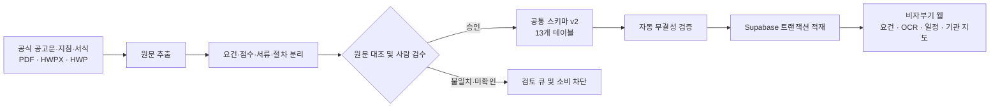

<p align="center">
  
</p>

<h1 align="center">비자부기 데이터 파이프라인</h1>

<p align="center">
  흩어진 비자 공고문을 <strong>검색·검증·계산 가능한 데이터</strong>로 바꿉니다.
</p>

<p align="center">
  <a href="https://www.python.org/"></a>
  <a href="https://supabase.com/"></a>
  <a href="#검증하기"></a>
</p>

비자부기(visa-bugi)는 충청북도 외국인 주민이 비자 요건, 준비서류, 행정 절차와 지원기관을 이해하고 추적하도록 돕는 디지털 서비스입니다. 이 저장소는 서비스의 데이터 기반을 담당합니다.

PDF·HWPX·HWP 형태의 공고문과 붙임자료에서 원문을 추출하고, 자격요건·점수표·신청절차·제출서류·쿼터·변경이력으로 구조화합니다. 자동 추출 결과를 바로 서비스하지 않고, **원문과 사람이 대조해 검수한 데이터만** 공통 스키마와 Supabase로 전달합니다.

- 공모전: **제13회 전국 ICT융합 공모전**
- 참가 분야: **디지털 시제품**
- 아이디어 유형: **충북 현안 해결 AI 혁신 - 인구감소 대응 및 외국인 정착 지원**
- 팀: **team-hansori**
- 웹 애플리케이션: [`team-hansori/visa-bugi-web`](https://github.com/team-hansori/visa-bugi-web)

---

## 한눈에 보기

| 구현 항목 | 현재 결과 |
|---|---:|
| 지원 체류자격 | F-2-R, E-7-4R, F-4-R, D-2 |
| 공통 데이터 구조 | 서비스 10개 + 근거·이관 3개 = **13개 테이블** |
| 공통 데이터 | **1,101개 레코드** |
| 원천 문서 | **24건** |
| 원천→공통 매핑 | **684건** |
| 자격조건 | **111건** |
| 단계별 제출서류 | **77건** |
| 쿼터 스냅샷 | **61건** |
| 기관 연락처 | **97건** |
| 자동 검증 | **407개 테스트 통과** |

수치는 2026년 8월 26일 저장소 기준입니다. 공고가 갱신되면 레코드 수와 최신 차수가 달라질 수 있습니다.

---

## 왜 별도의 데이터 파이프라인이 필요한가요?

비자 행정정보는 단순한 FAQ가 아닙니다.

- 하나의 문장 안에 여러 필수조건과 대체조건이 섞여 있습니다.
- 본문, 심사표, 붙임서식 사이에 표현이나 기준이 다를 수 있습니다.
- 공고 차수마다 정원, 점수, 제출서류와 적용기간이 바뀝니다.
- PDF와 HWPX의 페이지 번호가 서로 어긋나는 경우가 있습니다.
- 문서에 없는 값과 아직 확인하지 않은 값은 의미가 다릅니다.

그래서 비자부기는 생성형 AI의 답변을 곧바로 자격판정에 사용하지 않습니다. 공식 요건은 구조화된 규칙과 결정론적 계산으로 처리하고, AI는 원문 추출·쉬운 설명·다국어 안내를 보조합니다. 확인되지 않은 내용은 추측하지 않고 `검토 필요` 상태로 남깁니다.

---

## 동작 방식



### 기술 스택

<p align="center">
  
</p>

| 계층 | 사용 기술 | 역할 |
|---|---|---|
| 원문 처리 | Python, pdfplumber, pyhwp, lxml | PDF·HWPX·HWP 텍스트와 표 구조 추출 |
| 데이터 가공 | pandas, Polars | 요건·점수·서류·쿼터 정규화 및 차수 비교 |
| 검증 | pytest, Ruff | 스키마·의미·FK·회귀 자동 검증 |
| 데이터베이스 | PostgreSQL, Supabase | 공통 스키마 v2 저장 및 웹 서비스 제공 |
| 배포 자동화 | GitHub Actions, Supabase CLI | CI 검사, migration 및 안전한 데이터 적재 |

> 사용자 화면은 별도 [`visa-bugi-web`](https://github.com/team-hansori/visa-bugi-web) 저장소에서 Next.js, TypeScript, React와 Tailwind CSS로 구현합니다.

### 데이터 품질 원칙

1. **원문 보존**: 정규화한 값과 함께 `raw_text` 또는 `source_text`를 남깁니다.
2. **근거 추적**: 핵심 값은 문서 ID, 문서 유형, 공고 차수, 페이지와 검증일로 추적합니다.
3. **불확실성 구분**: `문서에 없음`, `해당 없음`, `아직 확인하지 않음`, `추출 실패`를 서로 다른 상태로 기록합니다.
4. **논리 보존**: 자격요건의 중첩 AND/OR, 필수 최소점수와 배타적 선택을 평면 문장으로 뭉개지 않습니다.
5. **충돌 공개**: 문서 간 기준이 다르면 임의로 하나를 숨기지 않고 두 근거와 검토 결정을 함께 남깁니다.
6. **검수 게이트**: 검토가 끝나지 않은 행은 자격판정·점수 계산·공통 데이터 배포에서 차단합니다.
7. **안전한 적재**: Supabase importer는 단일 트랜잭션으로 동작하며 검증 실패 시 전체를 롤백합니다.

---

## 공통 스키마 v2

검수된 서비스 데이터는 다음 관계로 구성됩니다.

```text
source_documents
       │ 근거
       ▼
visa_requirements
 ├─ visa_criterion_groups
 │    └─ visa_requirement_criteria
 ├─ visa_process_stages
 │    └─ document_requirements
 │         └─ document_attachment_relations
 ├─ visa_scoring_models
 │    └─ visa_scoring_items
 └─ visa_quota_policies
      └─ visa_quota_snapshots

change_history · source_record_mappings
```

- **서비스 테이블 10개**: 비자 기본정보, 논리형 자격조건, 점수, 절차, 서류, 쿼터
- **근거·이관 테이블 3개**: 원천 문서, 변경이력, 원천→공통 매핑
- 상세 컬럼, enum과 무결성 규칙: [`docs/schema-v2.md`](docs/schema-v2.md)
- Supabase 배포·복구 절차: [`docs/supabase-runbook.md`](docs/supabase-runbook.md)

---

## 데이터 출처

비자부기는 블로그·커뮤니티 게시물을 판정 근거로 사용하지 않습니다. 아래 공식 공고, 공공기관 안내와 대학 공개자료를 수집해 사람이 원문과 대조했습니다.

| 출처 기관 | 활용 범위 | 저장·검증 방식 |
|---|---|---|
| [충청북도 고시·공고](https://www.chungbuk.go.kr/www/selectGosiPblancList.do?key=422) | F-2-R 지역우수인재, E-7-4R 숙련기능인력, F-4-R 외국국적동포 공고문·붙임·서식 | 공고 차수, 공고일, 원문 위치와 검증일 기록 |
| [법무부 출입국·외국인정책본부](https://www.immigration.go.kr/) | 체류자격 제도와 출입국 행정의 상위 공식 근거 | 지자체 공고와 적용범위를 대조할 때 사용 |
| [충북지역대학혁신지원센터](https://cbrise.or.kr/sub.php?code=14) | 충북 소재 대학 및 광역형 유학비자 관련 안내 | 공개 목록을 사람이 직접 대조 |
| [한국유학종합시스템](https://www.studyinkorea.go.kr/ko/plan/certifiedUniversity.do#top) | 교육국제화역량 인증대학 | 2025년 인증 결과 기준으로 검증 |
| 충청북도 외국인정책 지원사업 안내서 | D-2 시간제취업, 광역형 유학비자 대상 대학·학과 | 문서 페이지와 원문을 함께 기록 |
| 대학 공식 모집요강 | 광역형 유학비자 대상 학과 교차검증 | 해당 대학 공개 모집요강의 학과명과 대조 |

현재 공통 스키마에 등록된 24개 문서의 상세 목록과 마지막 검증일은 [`extraction/common_v2/source_documents.csv`](extraction/common_v2/source_documents.csv)에서 확인할 수 있습니다. 각 데이터가 어느 원천 행에서 왔는지는 [`source_record_mappings.csv`](extraction/common_v2/source_record_mappings.csv)의 684개 매핑으로 추적합니다.

> **주의:** 이 저장소의 데이터는 공모전 시제품과 정보 접근성 개선을 위한 구조화 자료입니다. 법무부·출입국관서·충청북도 등 관할기관의 공식 결정이나 법률 자문을 대체하지 않습니다. 실제 신청 전에는 연결된 최신 원문과 담당기관 안내를 다시 확인해야 합니다.

---

## 빠른 시작

### 요구사항

- Python 3.11 이상
- [`uv`](https://docs.astral.sh/uv/) 권장

### 설치

```bash
git clone https://github.com/team-hansori/visa-data.git
cd visa-data
uv sync --extra dev
```

`pip`을 사용할 경우:

```bash
python -m venv .venv
source .venv/bin/activate  # Windows PowerShell: .venv\Scripts\Activate.ps1
pip install -e ".[dev]"
```

### 공통 데이터 확인

```bash
uv run python scripts/validate_common_schema_v2.py \
  --baseline extraction/common_v2/known_validation_gaps.txt
uv run python scripts/validate_source_record_mappings.py
```

### 공통 데이터 재생성

```bash
uv run python scripts/migrate_to_v2.py
```

기본 출력은 Git 추적에서 제외되는 `build/common_v2/`입니다. 원천 CSV를 덮어쓰지 않도록 출력 경로가 분리되어 있습니다.

### Supabase 적재 사전 점검

```bash
uv run python scripts/import_common_v2.py
```

실제 적재는 대상 프로젝트와 백업 상태를 확인한 뒤 `--apply` 옵션으로 실행합니다. 자세한 절차는 [`docs/supabase-runbook.md`](docs/supabase-runbook.md)를 따릅니다.

---

## 검증하기

```bash
uv run --extra dev ruff check src/ tests/
uv run --extra dev ruff format --check src/ tests/
uv run --extra dev pytest
```

현재 전체 테스트 결과는 **407 passed**입니다. 주요 검증 범위는 다음과 같습니다.

- 공통 스키마 헤더·enum·필수값
- UUID 중복과 FK 무결성
- 자격조건 그룹의 ROOT 유일성 및 순환참조
- AND/OR 의미와 자동·수동·안내용 판정 경계
- 제출서류 첨부관계의 순환참조
- 쿼터 배정·추천·잔여 수량 산술
- 원천 684행의 공통 레코드 매핑
- F-2-R·E-7-4R·F-4-R·D-2 대표 조회
- 마이그레이션·importer 회귀와 멱등성

---

## 저장소 구조

```text
visa-data/
├── extraction/
│   ├── A_F-2-R/          # F-2-R 원천 근거표와 차수별 비교
│   ├── B_E-7-4R/         # E-7-4R 요건·점수·서식·변경이력
│   ├── C_D-2-common/     # D-2 시간제취업·대학·학과 목록
│   ├── D_visa_requirements/
│   └── common_v2/        # 검수 완료 공통 데이터 13개 CSV
├── reference/            # 기관 연락처와 위험상황 라우팅
├── scripts/              # 추출·정규화·이관·검증·DB 적재
├── supabase/migrations/  # PostgreSQL 공통 스키마
├── tests/                # 단위·통합·회귀 테스트
├── docs/                 # 스키마 명세와 운영 runbook
├── reports/              # 감사·작업 보고서
└── src/                  # 재사용 가능한 시각화 코드
```

원본 문서는 저작권·배포조건과 제출 용량을 고려해 Git에서 제외될 수 있습니다. 이 경우에도 원문 식별정보, 상대 경로 또는 공식 URL, 페이지 기준과 마지막 검증일은 공통 출처 테이블에 남깁니다.

---

## 기여 및 변경 절차

1. 비자 유형과 대상 공고 차수를 명시한 Issue를 만듭니다.
2. 원문을 추출하되 `raw_text`를 임의로 수정하지 않습니다.
3. 수치·연산자·단위·AND/OR 관계와 출처 위치를 분리해 기록합니다.
4. 불일치와 미확인 사항은 검토 큐에 남기고 서비스 소비를 차단합니다.
5. 전용 검증기와 전체 테스트를 통과시킵니다.
6. PR 리뷰가 끝난 데이터만 `common_v2`와 Supabase에 반영합니다.

변경 내역은 [`CHANGELOG.md`](CHANGELOG.md)에서 확인할 수 있습니다.

---

## 외부 자료 이용 안내

원본 공고문·지침·대학 모집요강 등 외부 자료의 권리는 각 제공기관에 있으며 해당 기관의 이용조건을 따릅니다. 소스코드의 재배포·활용 조건은 제출본에 포함된 별도 라이선스 고지를 우선 확인해 주세요.
